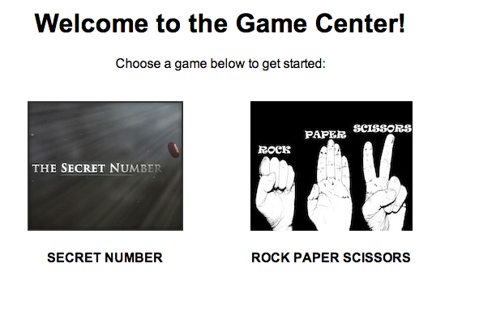
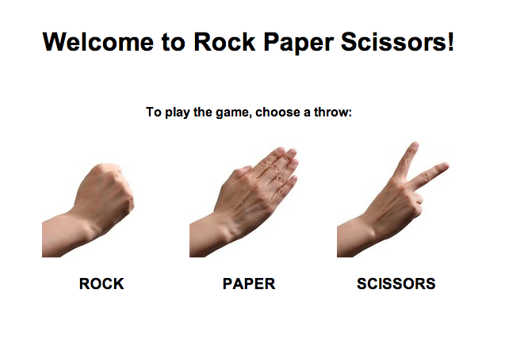

##Rock Paper Scissors

####Time: 60 min

###Activity Type: Pair Programming

####Task Instructions

*	Your Instructor will demo the final app, so you know how it works. 

Here are two screen shots to help you style the views.

*	Add the game Rock Paper Scissors to the "Games on Rails App".

*	Create a route that goes from /games/rock_paper_scissors/:throw to games#rock_paper_scissors_play.

*	Use params[:throw] as a user's choice. Assign this to @user_throw
*	Select a random throw from ["rock", "paper", "scissors"]. Assign this to @app_throw

*	Compare the 2! If the user's throw matches the apps throw, the user wins. Otherwise, show a loss message.

*	__Bonus__: Refactor the application so that it uses the real [rules of rock paper scissors](http://en.wikipedia.org/wiki/Rock-paper-scissors). 

We've provided the [images](images/) folder.

