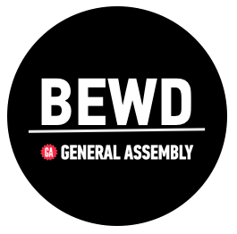

Congratulations on joining us at General Assembly for the __Back-End Web Development__ course! **All your class files can be found here**.

##GITHUB CLASS REPOSITORY

GitHub is a popular developer tool, and we want you to be familiar with it. GA is all about learning by doing, so to learn how to use GitHub we are going to use it every lesson as part of the course.

During the first lesson, you should have made a copy of this repo for your personal use (forked the repo). In addition, you should have created a link to the instructors copy on GitHub (adding an upstream remote).

We know it takes time to get familiar with GitHub so here are a few quick tips.

###How Do I Get Files From GitHub?

Each lesson the instructor will post slides, exercises and solution files. To get these files, pull (download) them from the instructors repository. 

From the terminal type: 
(make sure you are in the correct directory)

```bash
git pull upstream master
```
	
###How Do I Post Files To GitHub?

Yes, you may have your files locally on your computer but consider pushing them to the cloud. Here are some benefits. 

*	Easily share your homework with the instructional team for grading. 
*	Share your files with your teammates.

To __push__ files to GitHub:

From the terminal type:
(make sure you are in the correct directory)

	```bash
	git push origin master
	```
	
###What's in a lesson folder?

Each lesson folder contains

*	Code Alongs
*	Exercises
*	Readme (aka agenda)
*	Resources
*	Slides
		
###How Do I Submit Homework?

*	Get your homework starter code from the [Homework](Homework/) directory.

*	Follow the questions/prompts and complete the files.

*	To let your instructional team know your work is ready for grading, use the [homework submission form](__ENTER LINK HERE__). You will need a link to your homework that should be posted on GitHub. 

	*	If submitting Ruby HW, answer the questions in the [homework](Homework/) folder.
	
	*	If you are submitting a Rails App, create a new GitHub repository. 

###Where Can I Find Additional Practice Labs?

*	We have a more labs that are not part of the core curriulum. If you want some more practice, go to the Ruby & Rails [exercise bank](https://github.com/ga-students/Ruby_Rails_Exercise_Bank.git).


##GRADING

In order to pass this course General Assembly students must:

*	Complete and submit 80% of all course homework assignments. 

*	Complete and submit the course project (which may include a presentation), earning 	proficiency. See [Project Requirements](Final_Project/final_project_requirements.md). 


##TERMINOLOGY

|Term|Description|
|---|---|
|Course|Refers to all 20 classes which make up the BEWD curriculum|
|Lesson |One 3 hour session of the course. |
|In Class Lab (ICL)|Exercise files that are to be used in class as examples and practice.|
|Code Along| Are meant to be code by the instructor to demonstrate a concept. Type slowly and explain the concepts while students follow along.|
|Exercise |ICLs to be completed without instructor guidance.|
|Quick Fire| A programming challenge students must complete in class. aprox 30 min - 1 hour|
|Quiz|3-5 questions based on the material from the previous class.|
|Homework|Exercise files that are to be completed at home and reviewed during class.|
|Resources| Cheat sheet and links to additional information. Each lesson has one.|
|Final Project|The personal project each student will submit and present.|


	


